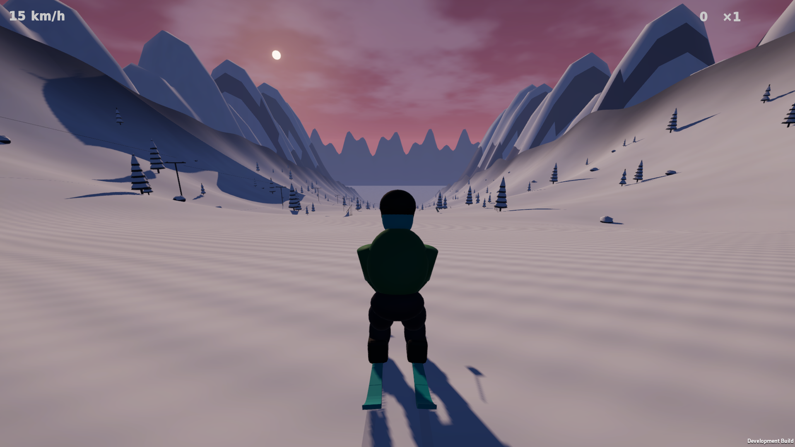
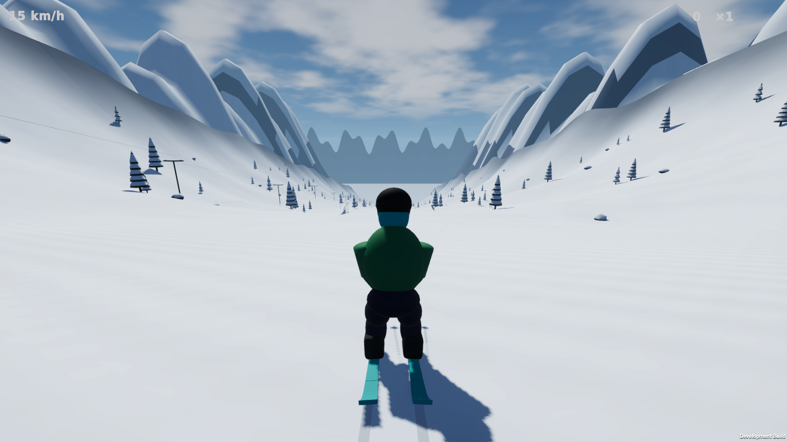

# VP1 — Rendering foundation

**Historical VP1 evidence.** The current character pass is reported in `../Phase2/REPORT.md`. The VP1 archive is preserved as `Builds/Packages/PowderFlow-VP1-Linux.tar.gz`; the usual package path now contains VP2.

2026-09-29 · Unity 6000.3.25f1 / URP 17.3 · Linux x86_64

## Changes

- Saved ACES tone mapping, bloom, vignette and grading as four persistent Volume subassets. Assigned the renderer's missing URP post resources. These settings now survive an editor reload and are included in the player.
- Enabled soft shadows, depth and HDR grading; tuned shadow bias and SSAO. Serialized exponential fog into both build scenes and retained the required shader variants so the native player has atmospheric depth.
- Fixed snow assignment on Blender materials such as `snow.001`. All ten terrain chunks now use Alpine Snow. A separate PackedSnow material keeps tree caps, rocks and jump sides snowy without terrain slope blending. Future imports canonicalize numeric suffixes.
- Balanced the Day/Sunset light, ambient, fog and sky palette. Added softer procedural clouds, a finite sun disk/halo, restrained snow variation, warped wind normals and distance-faded glitter. Reduced the first iteration's overly strong, broad snow stripes after inspecting captures.
- Added fixed park/vista shots, persistent-render-setting checks and p95/p99 native frame timing. Neutralized injected simulation input and isolated fake gamepads from real devices/focus in tests. Skiing force and trick/rail tuning were not changed.
- Added `--visual-day` for native review. Diagnostic launches run in the background so focus changes do not suspend captures; ordinary play retains its focus behavior. Two initial Day/menu launches timed out with background execution disabled and were excluded. The successful repeats produced fresh output.

The baseline review found that the earlier M9/M10 graphics descriptions overstated what was active in the saved player. The profile was empty, renderer post resources were absent, fog variants were stripped, and most generated snow surfaces retained plain Lit. The historical report now links to these corrections.

## Visual review

Inspected Day/Sunset at gameplay distance, both park detail views, both wide vistas, portrait, native gameplay and the main menu. `Before/` preserves the M10 comparison images; this folder contains the current captures. `Sunset-first-*` records the intermediate snow-detail review and is not the final profile.

- Native distant mountains now fade into the preset's fog color instead of becoming black silhouettes. Near features retain contrast.
- Day snow retains brightness headroom. In the fixed Day capture's lower-left snow crop `(0,750)–(700,1080)`, the old green/blue channels clipped at 255 across the crop; the new capture has no channel values at or above 254 in that crop. This is a local pixel check, not a whole-image quality score.
- Sunset has warmer lit snow and cooler shadows. Wind detail is strongest under the low sun; Day detail is more restrained. Soft contact shadows are visible under trees and skis.
- Current geometry still limits the result: the skier has primitive joint shapes and a dark rear silhouette, trees have repeated cone bands, and the distant ridge has a flat lower edge. These are scheduled for VP2/VP3. Menu styling is scheduled for VP6.

### Native player captures





## Verification

| Gate | Result |
|---|---|
| Full EditMode suite | 23 passed, 0 failed |
| Full PlayMode suite | 12 passed, 0 failed |
| Render test repeated after final snow/light tuning | 1 passed; all seven editor captures refreshed |
| Connected physics descent | 1,405 m; all five regions visited |
| Saved graphics checks | Four persistent post effects, renderer resources, fog retention, soft shadows, terrain/prop snow assignments; no shader errors |
| Latest fixed-camera render benchmark | 312.9 FPS, 1920×1080, synchronous GPU readback |
| Linux build | Succeeded; 183,332,044 bytes reported by BuildPipeline |
| Native Day/Sunset gameplay | Both exit 0; 101.85 m measured descent; maximum 17.49 m/s |
| Native main-menu capture | Exit 0 |
| Extracted archive launch | Portable Play.sh exits 0 and produces a fresh 1920×1080 menu capture; no runtime/shader errors |

The full suites ran during the foundation implementation; the render test was repeated after the final wind-strength and Day-intensity adjustment. The final background-diagnostic change was compiled and exercised in the successful native Day, Sunset and menu launches.

### Native performance

| Preset | Average FPS | Average frame | p95 frame | p99 frame |
|---|---:|---:|---:|---:|
| Sunset | 652.48 | 1.53 ms | 1.93 ms | 2.66 ms |
| Day | 737.68 | 1.36 ms | 1.60 ms | 1.91 ms |

Visible native Wayland player, 1920×1080, High quality, VSync disabled. Two seconds of warm-up followed by 12 seconds of automatic tucked skiing. Ryzen 9600X / Radeon RX 6600 XT / CachyOS. No runtime exceptions or shader errors were found in the successful native logs.

These are short upper-run measurements on this workstation. They exceed the 60 FPS target in this scenario; dense-region/action profiling remains VP7 work. The GPU-flushed camera benchmark is a separate rendering measurement. Neither result certifies longer play sessions or subjective art quality.

## Reproduce

Close the interactive editor before batch commands:

```bash
Tools/Build/polish-graphics.sh
Tools/Build/test.sh EditMode
Tools/Build/test.sh PlayMode
Tools/Build/build-linux.sh
Tools/Build/run.sh --smoke-test -screen-width 1920 -screen-height 1080 -screen-fullscreen 0 -logFile "$PWD/Logs/visual-player-sunset.log"
Tools/Build/run.sh --smoke-test --visual-day -screen-width 1920 -screen-height 1080 -screen-fullscreen 0 -logFile "$PWD/Logs/visual-player-day.log"
Tools/Build/run.sh --menu-capture -logFile "$PWD/Logs/visual-player-menu.log"
Tools/Build/package.sh
```

Each smoke launch overwrites its output beside the executable; copy the report/capture before launching the next preset. XML, profiles, `summary.json` and `package.sha256` in this folder preserve the delivery evidence.

## Package and next phase

Latest archive: `Builds/Packages/PowderFlow-Linux.tar.gz`, 70,472,527 bytes (67.2 MiB). Its SHA-256 is recorded in `package.sha256`. The original M10 archive is retained separately as `Builds/Packages/PowderFlow-M10-Linux.tar.gz`.

Extracted the refreshed archive into `Builds/VisualPolishPackageValidation` and launched its own `Linux/Play.sh --menu-capture` independently of the project launcher. It exited 0, generated a fresh 1920×1080 image and logged no runtime exceptions or shader errors.

Next is **VP2: skier, clothing, skis and pose readability**, as detailed in `Documentation/VISUAL_POLISH_PLAN.md`. VP2–VP7 remain planned.
