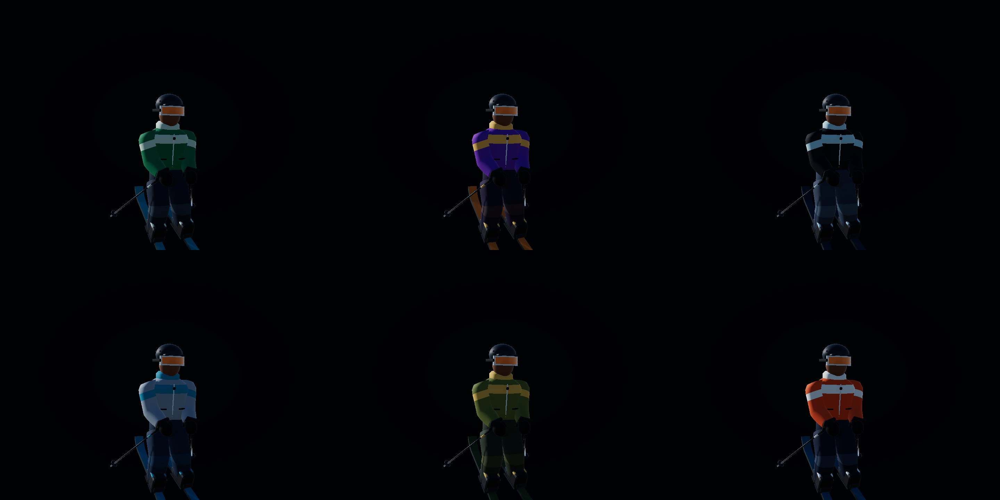
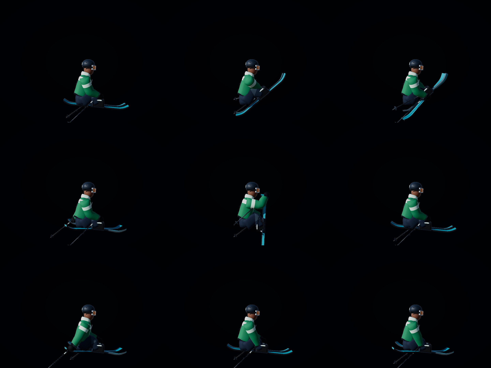
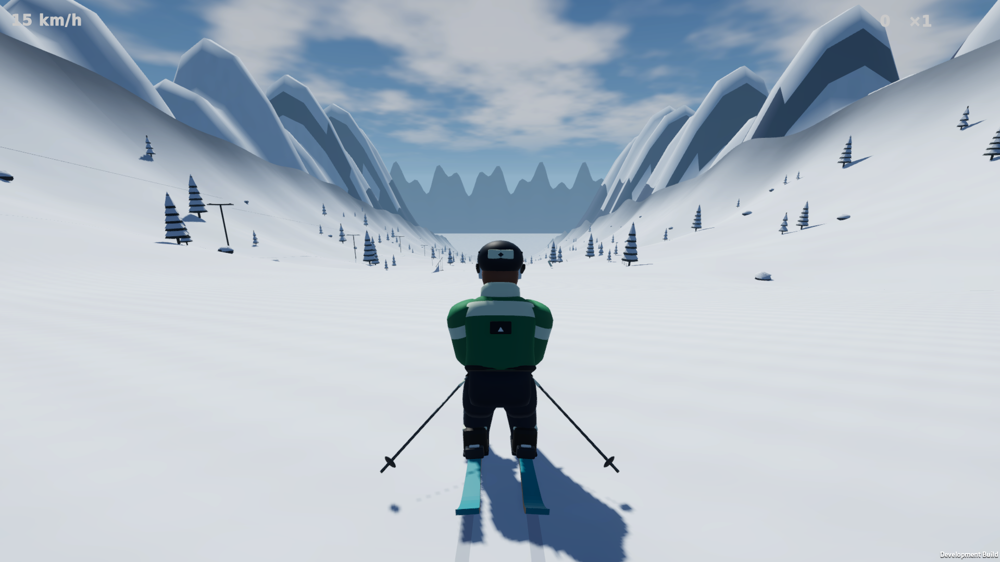
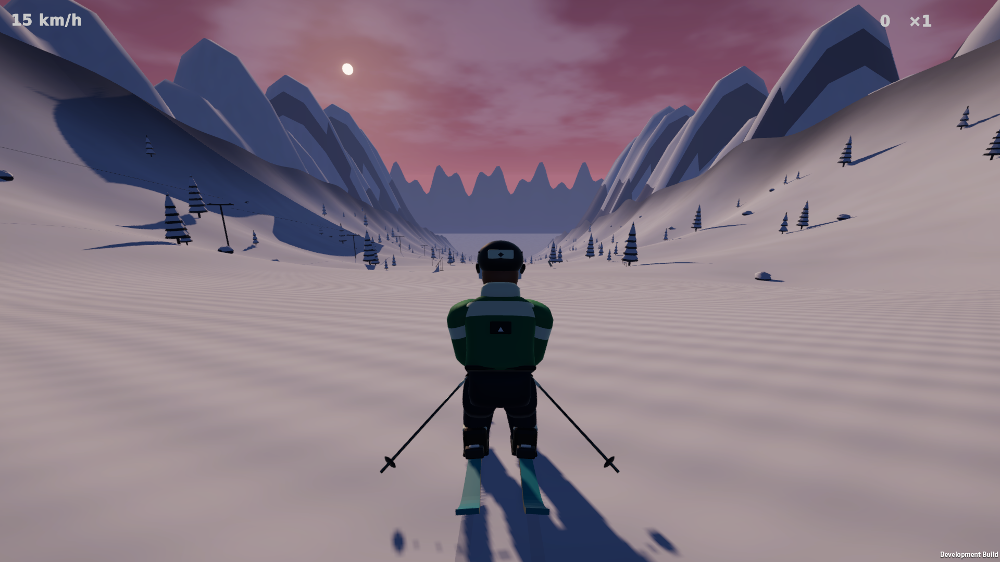

# VP2 — Skier, clothing, equipment and pose readability

2026-09-29 · Unity 6000.3.25f1 / Blender 5.2.2 · Linux x86_64

Historical VP2 evidence. Its archive is preserved locally as `Builds/Packages/PowderFlow-VP2-Linux.tar.gz`; the usual package path now follows VP3. Current scenery results are in `../Phase3/REPORT.md`.

## Changes

- Replaced the oval torso and separate limb shapes with a tapered padded jacket, shoulder transitions, collar/hood, hem, zipper, pockets and an original mountain badge. Sleeves and pant legs use continuous lofted meshes with blended elbow/knee weights. Waist and torso remain overlapping garments rather than exposed limb joints.
- Added curved goggles with a frame/strap, helmet vents/rear accent, gloves/thumbs/cuffs, boot soles/buckles/straps, separate toe/heel bindings, metal ski edges and curved tip/tail graphics. Twin tips remain 1.7 m long and retain the validated left/right bone convention.
- The character is **10,846 triangles**, up from 8,148. Geometry is consolidated into **five skinned renderers**: clothing and independent left/right skis/poles. Equipment mesh names remain distinct from bone names so binding finds the actual bones. Expanded bounds and offscreen skin updates keep posed equipment visible.
- Added the original Skier Surface shader, with distinct fabric/equipment smoothness, metal/lens response, subtle fabric variation, a restrained ambient floor and rim. Backlit clothing now has a readable shoulder band, collar and garment silhouette.
- Added **CharacterVisualConfig**, referenced through AssetCatalog. It contains pose response, bend/lean values, grab angles, pole motion, material response and six coordinated outfit palettes. Exact material matching preserves ski artwork and garment accents during outfit selection.
- Refined neutral/air/tuck/rail bend and head counter-rotation; added bend smoothing. Corrected ski local-position restoration so ground contact placement cannot carry offsets into flight. Mute/Japan fold the legs more tightly; Nose brings the tip up to the hand. Poles trail outward from the hand's actual side, including cross-body grabs.
- Improved AssetPreview with a framed studio view, outfit selection on **1–6**, rotation on **Left/Right**, and an outfit label. Regeneration and material configuration remain automatic.

Physics force, gravity, carve, air torque, rail capture, scoring and physical collider tuning were unchanged.

## Visual review

Inspected the Blender preview, six outfit views, all nine grab states from front/side/rear, airborne/tuck views, Day/Sunset landscape, portrait, crossed skis and visible native gameplay. Before images are retained in `Before/`.

Outfit sheet order: **Evergreen, Violet, Slate / Glacier, Alpine, Signal**.



Grab sheets use this order in every view:

| First row | Second row | Third row |
|---|---|---|
| Safety · Mute · Japan | Tail · Nose · Stale | Blunt · Method · CrissCross |



`GrabsFront.jpg` and `GrabsRear.jpg` provide the other views. The sleeves/knees retain continuous garment surfaces; equipment remains visible while folded and crossed. These are stylized procedural grab poses, not a claim of anatomical or reference-video accuracy. Dynamic action-sequence inspection remains VP7 work.

### Grab reach

Measured distance from the active wrist bone to the grab target after the pose settles. The glove extends beyond that bone; the gate allows less than 14 cm, approximately one glove length. This is a geometric reach check, not a finger-contact simulation.

| Grab | Wrist-to-target distance |
|---|---:|
| Safety | 11.2 cm |
| Mute / Japan | 7.9 cm |
| Tail / Blunt | 9.3 cm |
| Nose | 0.0 cm, rounded |
| Stale / Method / CrissCross | 11.2 cm |

The first review measured Nose at 65.3 cm and Mute/Japan at 20.4 cm. The refined leg/ski angles brought them inside the reach gate. Detailed results are in `grab-reach.txt`. The existing crossed-ski and grounded tuck alignment checks also pass.

### Native gameplay





## Verification

| Gate | Result |
|---|---|
| Blender manifest | 48 assets validated; character 10,846 triangles |
| Full EditMode | **24 passed**, 0 failed |
| Full PlayMode | **13 passed**, 0 failed |
| Final character capture/reach repeat | **1 passed**, after pole-direction refinement |
| Rig/geometry guards | Required bones, independent skis, left/right placement, blended weights, 10–15k triangle budget, bounded renderer count, shader and palette checks pass |
| Gameplay regressions | Ground/air/tricks, flat/down/kink rails, ragdoll/reset, controller/menu/save checks pass |
| Connected descent | 1,405 m; all five mountain regions visited |
| Fixed-camera GPU-flushed render | 419.5 FPS at 1920×1080 |
| Linux build | Succeeded; 183,705,372 bytes reported |
| Native Day/Sunset gameplay | Both exit 0; 101.85 m measured descent; maximum 17.49 m/s |
| Native menu | Exit 0; updated capture |
| Extracted Linux archive | Portable Play.sh exits 0; fresh 1920×1080 menu capture; no exception or shader errors |

The full suites ran before the final pole-side adjustment. The character capture/reach test was repeated after that change, followed by the final build and native profiles. One editor review launch stalled before tests began; it was stopped and a fresh launch passed. No C# or shader errors remain. Successful native logs contain no runtime exceptions or shader errors.

### Native performance

| Preset | Average FPS | Average frame | p95 frame | p99 frame |
|---|---:|---:|---:|---:|
| Sunset | 639.73 | 1.56 ms | 2.00 ms | 2.25 ms |
| Day | 675.11 | 1.48 ms | 1.80 ms | 2.28 ms |

Visible native Wayland player, 1920×1080, High quality, uncapped, VSync disabled. Two-second warm-up followed by 12 seconds of automatic upper-run tuck. Ryzen 9600X / Radeon RX 6600 XT / CachyOS. Both exceed the 60 FPS target in this short scenario. Dense-region/action profiling, longer play and subjective visual/feel approval remain later review work. The fixed-camera benchmark is a separate measurement.

## Try and reproduce

Play: `Tools/Build/run.sh`, select **FREE RIDE**. Settings provide six outfit presets. Q/E grab, Shift/Ctrl change grabs, Q+E crosses skis, L changes lighting. In Unity, `AssetPreview.unity` provides model/outfit review; `Mountain.unity` starts on snow.

Pose/palette/material parameters: `Assets/Settings/CharacterVisualConfig.asset`. Geometry source: `Tools/Blender/create_skier.py` and `ArtSource/Blender/Skier.blend`.

Close the interactive editor before batch commands:

```bash
Tools/Build/generate-assets.sh character
Tools/Build/polish-character.sh
Tools/Build/test.sh EditMode
Tools/Build/test.sh PlayMode
Tools/Build/build-linux.sh
Tools/Build/run.sh --smoke-test -screen-width 1920 -screen-height 1080 -screen-fullscreen 0 -logFile "$PWD/Logs/character-sunset.log"
Tools/Build/run.sh --smoke-test --visual-day -screen-width 1920 -screen-height 1080 -screen-fullscreen 0 -logFile "$PWD/Logs/character-day.log"
Tools/Build/package.sh
```

Each diagnostic launch overwrites output beside the executable. Copy reports/captures between presets. The targeted review command is `Tools/Build/test.sh PlayMode PowderFlow.Tests.CharacterPolishTests`.

## Package and next phase

Current archive: `Builds/Packages/PowderFlow-Linux.tar.gz`, **70,450,248 bytes** (67.2 MiB). SHA-256 is recorded in `package.sha256`. VP1 is preserved as `PowderFlow-VP1-Linux.tar.gz`; M10 remains `PowderFlow-M10-Linux.tar.gz`. XML, native JSON and `summary.json` preserve the phase evidence.

The current archive was extracted into a separate validation directory and launched through its own portable `Play.sh`. It exited successfully and created a fresh 1920×1080 menu capture. The archive checksum matches the recorded phase checksum.

Next is **VP3: mountain and vegetation composition** — irregular pines, shrubs/rock clusters, layered ridge silhouettes and recognizable region composition. Props, effects, UI and final action review follow in VP4–VP7.
