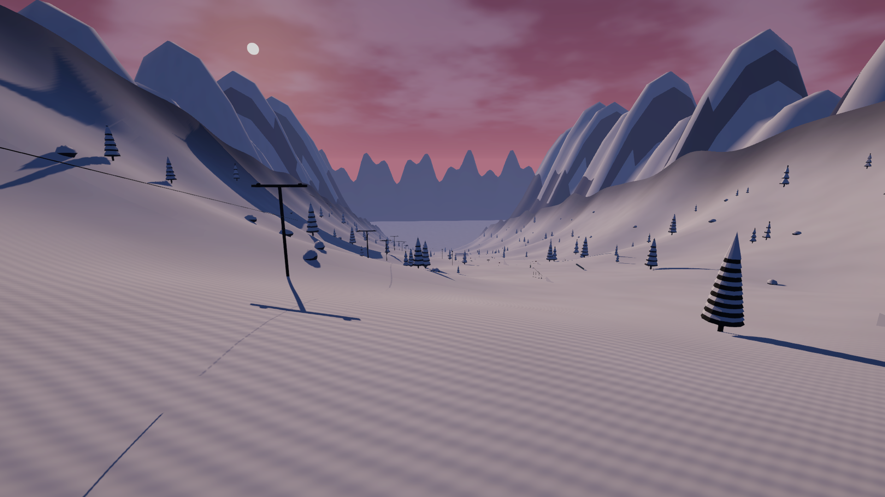
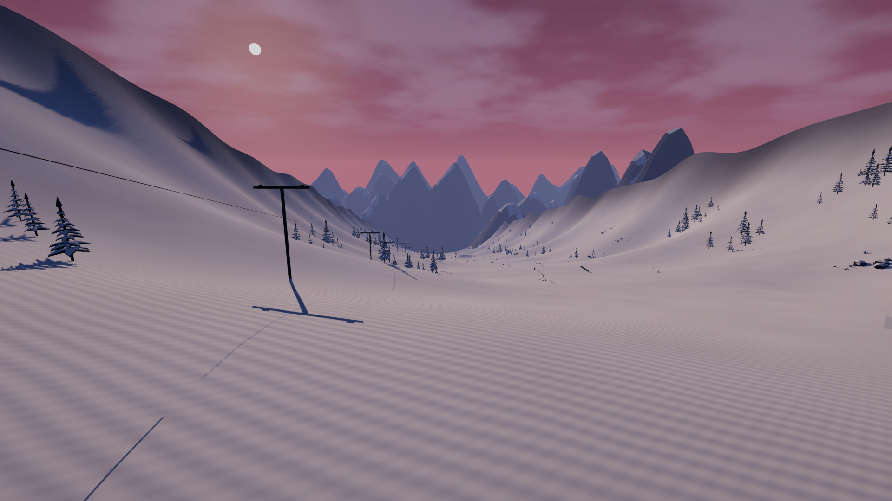
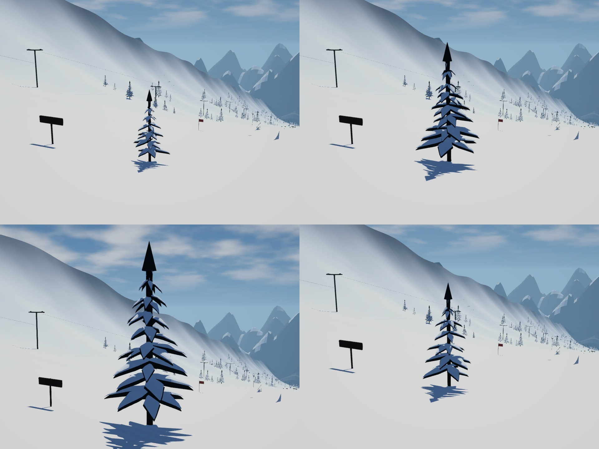

# VP3 — Mountain and vegetation composition

**Historical VP3 report.** Current delivery results are in `../Phase4/REPORT.md`. The original VP3 archive is preserved locally as `Builds/Packages/PowderFlow-VP3-Linux.tar.gz`; the usual `PowderFlow-Linux.tar.gz` path now contains VP4 and uses its checksum.

Completed 2026-09-29. VP3 replaces repeated cone trees and ridge walls with varied alpine scenery. Gameplay, menus, editor Play mode and diagnostics now use a **144 FPS cap**, as requested. Routine performance benchmarks and FPS success gates have been removed.

## What changed

- Four pine variants use seeded asymmetric branch whorls, layered snow lobes and narrow crowns. Branch meshes are consolidated into one renderer per LOD, retaining trunk capsule collisions.
- Three decreasing geometry LODs preserve the branch layout and crossfade over 0.3 seconds. The custom snow shader now supports the same dither transition as URP Lit.
- Six faceted snow-covered rocks form small clusters with two new shrub variants. Shrubs have three LODs and no collision geometry.
- Five distinct ridge layers have skewed peaks, foreground shoulders, snow ledges and buried skirts. A rolling noncolliding valley backdrop replaces the flat base transition.
- Regional density, scale, spacing, clearance and range placement live in WorldConfig. MountainScenery uses the existing seed and protects the central route, freeride corridor, side-feature approaches, lift spans and fence.
- Distant backdrops no longer cast shadows across the riding mountain. This corrected an overly dark lower run at sunset; nearby terrain, vegetation and props retain shadows.
- A scenery-only generation stage preserves the ten riding-terrain exports. Their hashes match the VP2 baseline. Ski force, air, rail and feature-surface tuning are unchanged.

## Geometry and placement

| Asset | LOD0 triangles | LOD1 | LOD2 |
|---|---:|---:|---:|
| Pine0 | 3,650 | 2,326 | 1,166 |
| Pine1 | 4,354 | 2,774 | 1,390 |
| Pine2 | 4,794 | 3,054 | 1,530 |
| Pine3 | 3,650 | 2,326 | 1,166 |
| Shrub0 | 384 | 240 | 168 |
| Shrub1 | 512 | 320 | 224 |

The manifest contains **52 assets**. Pine LOD0 remains below 6,000 triangles, with three renderers across the complete prefab instead of separate branch primitives.

| Region | Trees | Central clearance, each side | Composition |
|---|---:|---:|---|
| Easy | 37 | 54 m | Broad open start, smaller scattered clusters |
| Park | 116 | 32 m | Closer tree edges around clear approaches |
| Big Air | 24 | 62 m | Open landing vista |
| Freeride | 95 | 34 m | Larger clusters framing protected powder gaps |
| Lower | 48 | 45 m | Smaller trees and a calmer finish |

Total placement: **320 trees, 70 rocks and 160 shrubs**, with at least 5.5 m between tree centers. Additional padding and dedicated protected areas apply when accepting placements.

## Inspected visual evidence

Matched VP2 baseline views are preserved in `Before/`. Review included both lighting presets in all five regions, pine variants, all three LODs, the moving approach sequence and native player captures. The wide vistas now have several separate silhouettes, while the central line remains readable.

Before:

After:

[Moving LOD review — 6 seconds, 1280×720](TreeLodSweep.mp4). [Current capped gameplay capture](CappedGameplay.png). Regional Day/Sunset views and the native player images are saved beside this report.

## Validation

| Check | Result |
|---|---|
| Asset manifest | 52 entries valid |
| EditMode | 25/25 pass, including terrain/rig, bounded LODs, collider rules, backdrop shadows and shader compilation |
| Targeted PlayMode | 3/3 pass: scenery, graphics and connected descent |
| Final scenery review | 1/1 pass after the crown/backdrop corrections |
| Graphics review after benchmark removal | 1/1 pass; Day/Sunset/portrait and park/vista captures retained |
| Connected physics descent | Reached 1,405 m through all five regions |
| Placement | Configured counts and minimum spacing pass; protected corridors are clear; sampled powder heights agree with terrain |
| Terrain preservation | All ten riding FBX hashes unchanged |
| Current native launch | 1920×1080, High, Sunset, cap 144, VSync 0; 101.99 m travel; exit 0 |
| Linux build | BuildPipeline succeeded; 188,154,425 bytes reported |
| Extracted package | Its own Play.sh launched and saved a fresh 1920×1080 menu image; exit 0 |

The successful native gameplay/package logs contain no runtime exceptions or shader errors. XML and `summary.json` retain the checks. The initial PlayMode XML and `HistoricalUncapped/` retain earlier timing output collected before the cap request; those figures are not current completion criteria. Current diagnostics collect travel and settings without measuring frame times.

Earlier capture fixture failures were resolved by ignoring trigger zones in floor raycasts and selecting a continuous freeride descent at x=75/z=1120 with recorded 15 m/s incoming speed. The lower-run diagnostic uses eight seconds to stay before the existing end reset. These are diagnostic setup changes; powder friction/drag and riding geometry were retained.

## Build and reproduction

Play the current build with `Tools/Build/run.sh`. The distributable is `Builds/Packages/PowderFlow-Linux.tar.gz`: **70,320,512 bytes**. Its SHA-256 is **44586ced1361ea5d2854eef405811e478b5bb7068b3b27906201a0ded2bff1d5** and is also recorded in `package.sha256`. VP2 is preserved locally as `PowderFlow-VP2-Linux.tar.gz`.

For scenery edits, close the interactive editor, run `Tools/Build/generate-assets.sh scenery`, then `Tools/Build/polish-environment.sh`. Use relevant targeted checks for the change, then rebuild/package when delivering it. No full suite or regional launch matrix is required for every visual adjustment.

Optional native visual capture: `python Tools/Validation/capture_regions.py` selects one Sunset/Easy run by default. `--only SunsetPark DayFreeride` captures specific views when needed. All use the 144 FPS limit and validate launch/travel without benchmarks.

## Remaining review and next phase

An existing camera/jump overlap appears as a horizontal strip at the top of the native Park capture during a feature transition. Keep it for **VP6 camera obstruction review**. Trees remain stylized geometry LODs without billboards. Captures and automated descent checks do not certify subjective skiing feel or extended play stability.

Next: **VP4 — park features and mountain props**. Finish rails/boxes, visual jump sides, hut/lift/floodlight detail, original signage and boundary markers.
